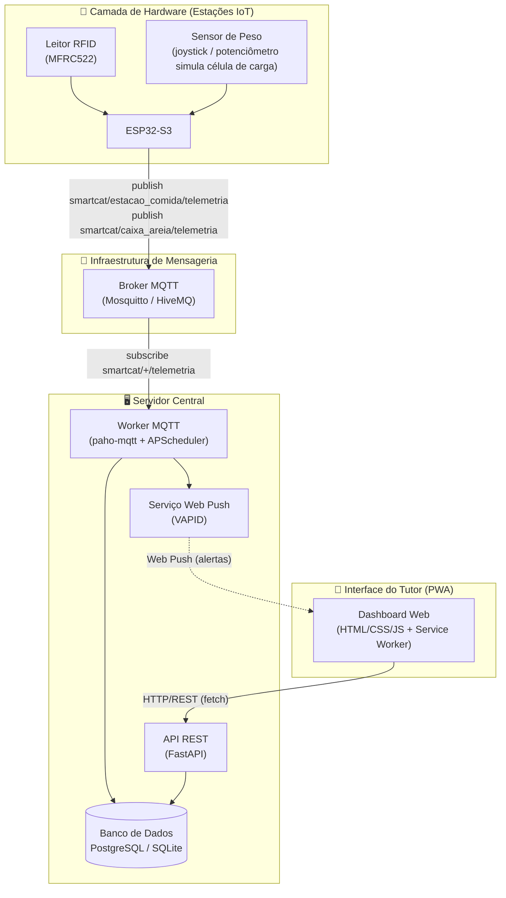
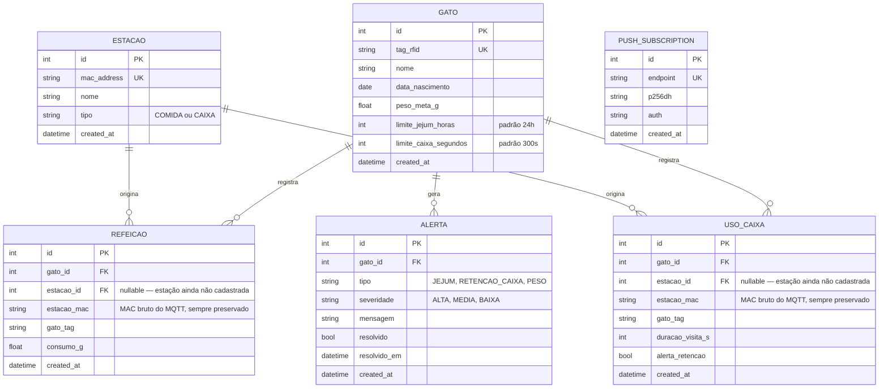
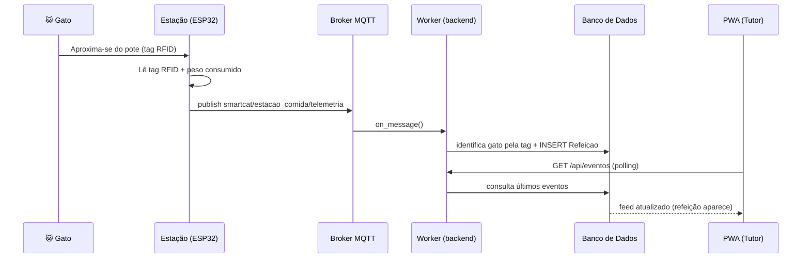
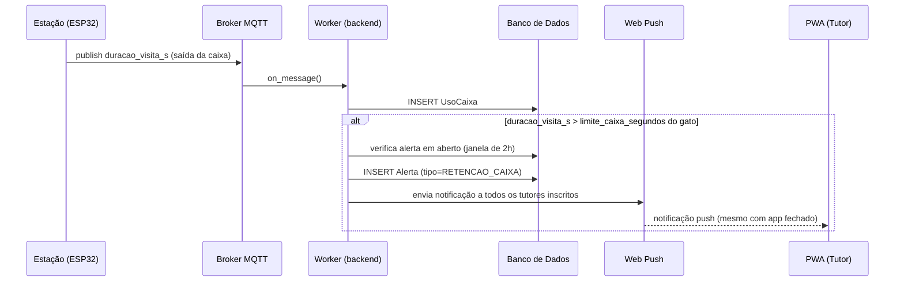
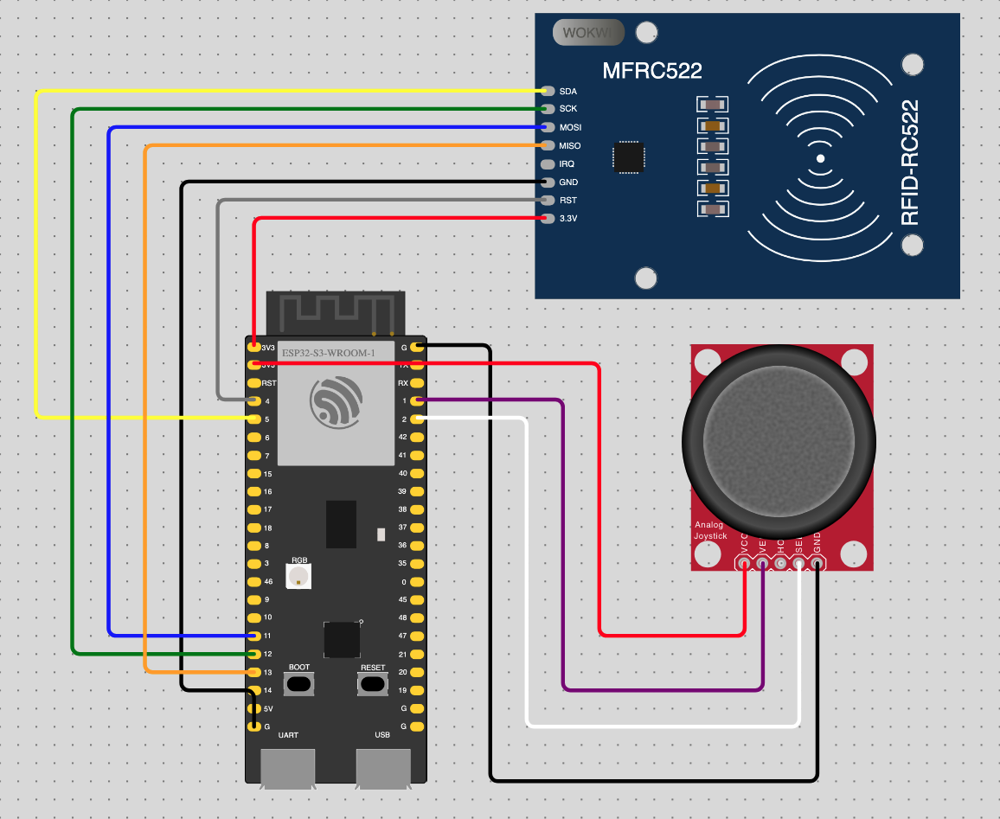

# 🐱 SmartCat IoT

Sistema integrado de **Internet das Coisas (IoT)** para monitoramento remoto de gatos domésticos: identifica cada pet por **RFID**, mede o **consumo de ração** e o **tempo de uso da caixa de areia**, e envia **alertas de saúde** em tempo real ao tutor por meio de uma **Progressive Web App (PWA)**.

> Alterações sutis de rotina — comer menos, ficar mais tempo na caixa de areia, jejuar por muitas horas — costumam ser os primeiros sinais de problemas como estresse, diabetes ou infecções urinárias. O SmartCat automatiza essa observação, que normalmente depende só do olho do tutor.

---

## 📋 Sumário

- [Problema e Objetivos](#-problema-e-objetivos)
- [Arquitetura](#-arquitetura)
- [Funcionalidades](#-funcionalidades)
- [Stack Tecnológica](#-stack-tecnológica)
- [Estrutura do Repositório](#-estrutura-do-repositório)
- [Modelo de Dados](#-modelo-de-dados)
- [Fluxo de Eventos (MQTT)](#-fluxo-de-eventos-mqtt)
- [Regras de Alerta de Saúde](#-regras-de-alerta-de-saúde)
- [API REST](#-api-rest)
- [Notificações Web Push](#-notificações-web-push)
- [Instalação em Dispositivos Móveis](#-instalação-em-dispositivos-móveis)
- [Como Executar](#-como-executar)
  - [Opção A — Docker Compose (recomendado)](#opção-a--docker-compose-recomendado)
  - [Opção B — Execução manual (dev)](#opção-b--execução-manual-dev)
  - [Firmware (ESP32 / Wokwi)](#firmware-esp32--wokwi)
- [Variáveis de Ambiente](#-variáveis-de-ambiente)
- [Roadmap](#-roadmap)
- [Licença](#-licença)

---

## 🎯 Problema e Objetivos

Tutores de gatos têm dificuldade em acompanhar com precisão a rotina de seus pets — frequência de alimentação, gramas exatas de ração consumidas e uso da caixa de areia — especialmente em lares com múltiplos animais, onde não dá para saber *quem* comeu ou usou a caixa. O SmartCat resolve isso com sensoriamento automatizado e individualizado.

**Objetivo geral:** registrar de forma automatizada e individual o comportamento alimentar e de higiene de cada gato, disponibilizando esses dados ao tutor em tempo real.

**Objetivos específicos:**

| Objetivo | Como o sistema atende |
|---|---|
| Identificação individual | Leitura de tag RFID a cada aproximação de uma estação |
| Coleta e telemetria | Estações publicam eventos via **MQTT** (protocolo leve, ideal para IoT) |
| Acompanhamento remoto | PWA para cadastrar pets/estações e visualizar histórico e métricas |
| Alertas preventivos | Parâmetros configuráveis por gato (peso meta, limite de jejum, limite de permanência na caixa) geram alertas automáticos + push |

---

## 🏗️ Arquitetura

O sistema é dividido em três camadas fracamente acopladas, comunicando-se por MQTT (hardware → servidor) e HTTP/REST (servidor ↔ PWA).



**As três camadas do projeto:**

1. **Hardware e Sensoriamento (Estações IoT)** — dispositivos ESP32 posicionados no pote de comida e na caixa de areia, responsáveis por ler a tag RFID do pet e medir as variáveis físicas (peso consumido / tempo de permanência).
2. **Infraestrutura e Mensageria (Servidor Central)** — recebe os eventos via broker MQTT, persiste em banco relacional e aplica as regras de negócio (deduplicação de alertas, verificação de jejum, notificações).
3. **Aplicação e Interface (PWA)** — dashboard responsivo para o tutor cadastrar pets e estações, acompanhar o feed de eventos em tempo real e reagir a alertas de saúde, com suporte a notificações push mesmo com o app fechado.

---

## ✨ Funcionalidades

- 🐾 **CRUD de pets** — cadastro de gatos com tag RFID, nome, data de nascimento, peso meta, limite de jejum (h) e limite de permanência na caixa (s)
- 📶 **CRUD de estações** — vincula estações físicas (identificadas por MAC address) como `COMIDA` ou `CAIXA`
- 🍽️ **Registro automático de refeições** — consumo em gramas, por gato e por estação
- 🧹 **Registro automático de uso da caixa de areia** — duração da visita, com sinalização de retenção excessiva
- 📰 **Feed unificado de eventos** — refeições e visitas à caixa, mais recentes primeiro, com nomes resolvidos
- 🚨 **Alertas de saúde automáticos**, com deduplicação (evita spam):
  - Jejum prolongado (verificação periódica a cada 15 min)
  - Retenção excessiva na caixa de areia
- 🔔 **Notificações Web Push** (protocolo VAPID) — o tutor recebe o alerta mesmo com o navegador fechado
- 📲 **PWA instalável e com suporte offline** — manifest + Service Worker (com cache de assets estáticos), ícones dedicados para Android e iOS, e botão de instalação nativo em navegadores compatíveis (ver [Instalação em Dispositivos Móveis](#-instalação-em-dispositivos-móveis))
- 🔁 **Identificação sem leitor dedicado na caixa** — o firmware reaproveita a última tag lida no pote de comida dentro de uma janela de 10s, simulando a identificação do gato na caixa de areia com um único leitor RFID

---

## 🧰 Stack Tecnológica

| Camada | Tecnologias |
|---|---|
| **Firmware** | C++ (Arduino framework), PlatformIO, ESP32-S3, simulação via **Wokwi** |
| **Bibliotecas do firmware** | `ArduinoJson`, `PubSubClient` (MQTT), `MFRC522` (RFID) |
| **Backend** | Python 3.10, **FastAPI**, Uvicorn, SQLAlchemy ORM |
| **Mensageria** | MQTT — `paho-mqtt` (worker) / **Eclipse Mosquitto** ou `broker.hivemq.com` (broker público) |
| **Agendamento** | APScheduler (varredura periódica de jejum) |
| **Banco de dados** | PostgreSQL 15 (produção/Docker) ou SQLite (fallback local) |
| **Notificações** | Web Push API + VAPID (`pywebpush`, `cryptography`) |
| **Frontend (PWA)** | HTML5, CSS3, JavaScript (Vanilla), Service Worker, Web App Manifest |
| **Infraestrutura** | Docker & Docker Compose |
| **Deploy alternativo** | `passenger_wsgi.py` (suporte a hospedagem compatível com Passenger/cPanel) |

---

## 📁 Estrutura do Repositório

```
SmartCat_IoT/
├── backend/
│   ├── app/
│   │   ├── main.py            # API REST (FastAPI) — rotas de gatos, estações, alertas, push
│   │   ├── worker.py          # Worker MQTT — ingestão de telemetria + regras de alerta
│   │   ├── push_service.py    # Lógica compartilhada de envio de Web Push (VAPID)
│   │   ├── database.py        # Modelos SQLAlchemy (ORM) e conexão com o banco
│   │   ├── static/
│   │   │   └── icons/           # icon-192.png, icon-512.png, apple-touch-icon.png
│   │   └── templates/
│   │       └── index.html      # Dashboard servido na rota "/"
│   ├── passenger_wsgi.py       # Entry point para hospedagem via Passenger/cPanel
│   ├── requirements.txt
│   ├── Dockerfile
│   └── .env.example
├── docker/
│   ├── docker-compose.yaml     # Orquestra db (Postgres) + broker (Mosquitto) + web (API)
│   ├── mosquitto.conf
│   └── .env.example
├── firmware/
│   ├── src/main.cpp            # Firmware ESP32-S3 (leitura RFID + peso + envio MQTT)
│   ├── platformio.ini          # Dependências e board de destino
│   ├── diagram.json            # Esquema de ligação para simulação Wokwi
│   └── wokwi.toml
├── scripts/
│   └── generate_vapid_keys.py  # Gera par de chaves VAPID para o Web Push
└── LICENSE                     # Apache License 2.0
```

---

## 🗄️ Modelo de Dados



> `estacao_id` é uma chave estrangeira de verdade para `ESTACAO.id`, mas fica `nullable`: como os eventos chegam via MQTT identificando a estação só pelo MAC address, é possível que a estação ainda não tenha sido cadastrada no sistema no momento do evento. Por isso existe também o campo `estacao_mac`, que sempre guarda o MAC bruto recebido — nada se perde mesmo quando `estacao_id` fica nulo, e o dado fica disponível para uma eventual reconciliação posterior (ex.: uma refeição registrada antes do tutor cadastrar a estação).

---

## 📡 Fluxo de Eventos (MQTT)

Cada estação publica em um tópico próprio; o worker do backend assina o wildcard `smartcat/+/telemetria`.

| Tópico | Publicado por | Payload (JSON) |
|---|---|---|
| `smartcat/estacao_comida/telemetria` | Estação de comida | `{ "estacao_id": "ESP32_...", "gato_tag": "A1B2C3D4", "consumo_g": 42.5 }` |
| `smartcat/caixa_areia/telemetria` | Estação da caixa de areia | `{ "estacao_id": "ESP32_...", "gato_tag": "A1B2C3D4", "duracao_visita_s": 87 }` |

### Sequência: refeição registrada



### Sequência: uso da caixa de areia com alerta



---

## 🚨 Regras de Alerta de Saúde

Implementadas em `backend/app/worker.py`:

| Tipo | Gatilho | Frequência de checagem |
|---|---|---|
| **JEJUM** | Nenhuma refeição registrada dentro de `limite_jejum_horas` (padrão 24h) | Varredura agendada a cada **15 minutos** (APScheduler) sobre todos os gatos cadastrados |
| **RETENCAO_CAIXA** | Duração da visita à caixa de areia excede `limite_caixa_segundos` (padrão 300s / 5 min) | Em tempo real, a cada evento MQTT recebido |

Ambos os tipos passam por **deduplicação**: se já existe um alerta do mesmo tipo em aberto (não resolvido) para aquele gato criado nas últimas **2 horas**, um novo alerta/nova notificação não é disparado — evitando spam ao tutor. Alertas podem ser marcados como resolvidos pelo tutor via `PUT /api/alertas/{id}/resolver`.

---

## 🔌 API REST

Base URL local: `http://localhost:8000`

| Método | Rota | Descrição |
|---|---|---|
| `GET` | `/` | Serve o dashboard PWA (`index.html`) |
| `GET` | `/api/gatos` | Lista todos os pets cadastrados |
| `POST` | `/api/gatos` | Cadastra um novo pet (tag RFID única) |
| `PUT` | `/api/gatos/{id}` | Atualiza dados de um pet |
| `DELETE` | `/api/gatos/{id}` | Remove um pet |
| `GET` | `/api/estacoes` | Lista estações cadastradas |
| `POST` | `/api/estacoes` | Cadastra uma estação (MAC address único) |
| `PUT` | `/api/estacoes/{id}` | Atualiza uma estação |
| `DELETE` | `/api/estacoes/{id}` | Remove uma estação |
| `GET` | `/api/refeicoes` | Últimas 50 refeições registradas |
| `GET` | `/api/caixa-areia` | Últimos 50 usos da caixa de areia |
| `GET` | `/api/eventos` | Feed unificado (refeições + caixa), últimos 50, mais recentes primeiro |
| `GET` | `/api/alertas?apenas_abertos=` | Lista alertas (opcionalmente só os não resolvidos) |
| `PUT` | `/api/alertas/{id}/resolver` | Marca um alerta como resolvido |
| `GET` | `/api/push/vapid-public-key` | Retorna a chave pública VAPID para o navegador se inscrever |
| `POST` | `/api/push/subscribe` | Registra a inscrição push do navegador do tutor |
| `POST` | `/api/push/unsubscribe` | Remove a inscrição push |
| `POST` | `/api/push/test` | Dispara uma notificação de teste para todos os inscritos (debug rápido) |

A documentação interativa (Swagger) fica disponível automaticamente em `/docs` graças ao FastAPI.

---

## 🔔 Notificações Web Push

O sistema usa o padrão **Web Push + VAPID**, permitindo alertas mesmo com o navegador fechado (via Service Worker):

1. Gere um par de chaves VAPID:
   ```bash
   python scripts/generate_vapid_keys.py
   ```
2. Copie a saída para `backend/.env` (e/ou `docker/.env`, se estiver usando Docker):
   ```
   VAPID_PUBLIC_KEY=...
   VAPID_PRIVATE_KEY=...
   VAPID_CLAIM_EMAIL=mailto:seuemail@dominio.com
   ```
3. No dashboard, o tutor clica em **"🔕 Ativar notificações"** — o navegador se inscreve via `PushManager` e a inscrição é enviada para `POST /api/push/subscribe`.
4. Quando o worker gera um alerta (`registrar_alerta`), ele envia a notificação para **todas** as inscrições salvas; assinaturas expiradas (HTTP 404/410) são removidas automaticamente.
5. Depois de ativar, aparece o botão **"🧪 Enviar teste"** — dispara `POST /api/push/test`, útil para validar a configuração VAPID e a inscrição do navegador sem precisar esperar um alerta real de saúde acontecer.

A lógica de envio (`enviar_push_para_todos`) fica centralizada em `backend/app/push_service.py`, reaproveitada tanto pelo `worker.py` (alertas automáticos) quanto pelo `main.py` (endpoint de teste).

---

## 📲 Instalação em Dispositivos Móveis

O SmartCat é um PWA instalável — funciona em tela cheia, como um app nativo, sem passar pela loja de aplicativos. O comportamento muda conforme a plataforma:

| Plataforma | Como instalar |
|---|---|
| **Android** (Chrome, Edge, Samsung Internet) | O navegador detecta automaticamente que o app é instalável e mostra um banner ou o botão **"⬇️ Instalar app"** no cabeçalho do próprio SmartCat |
| **Desktop** (Chrome/Edge no Windows, macOS, Linux) | Ícone de instalação (⊕) na barra de endereço, ou o mesmo botão **"⬇️ Instalar app"** |
| **iOS** (Safari) | Instalação manual: toque em **Compartilhar** (ícone de seta para cima) → **"Adicionar à Tela de Início"**. O Safari não dispara instalação automática nem exibe o botão do app — essa limitação é do próprio iOS |

**Pré-requisitos técnicos** (já implementados no projeto):

- `manifest.json` com ícones `192x192` e `512x512` (`purpose: "any maskable"`)
- Ícone dedicado `apple-touch-icon.png` (180x180, opaco, sem cantos arredondados — o iOS aplica o arredondamento sozinho)
- Service Worker (`sw.js`) registrado, com handler de `fetch` — os arquivos estáticos ficam em cache, então o app abre mesmo sem conexão (os dados dinâmicos da API continuam exigindo rede)
- **Servir a aplicação via HTTPS** — obrigatório para instalabilidade em produção (exceto em `localhost`, que é tratado como seguro para testes)

---

## 🚀 Como Executar

### Opção A — Docker Compose (recomendado)

Sobe banco de dados (Postgres), broker MQTT (Mosquitto) e a API/worker de uma vez.

```bash
cd docker
cp .env.example .env        # preencha as chaves VAPID (opcional, mas recomendado)
docker compose up --build
```

- Dashboard: [http://localhost:8000](http://localhost:8000)
- Documentação da API: [http://localhost:8000/docs](http://localhost:8000/docs)
- Broker MQTT local: `localhost:1883`

> ⚠️ Por padrão, o `docker-compose.yaml` aponta `MQTT_BROKER=broker.hivemq.com` (broker público) em vez do broker Mosquitto local que ele mesmo sobe — ajuste essa variável para `broker` se quiser usar o Mosquitto do próprio Compose (rede interna do Docker).

### Opção B — Execução manual (dev)

```bash
cd backend
python -m venv venv && source venv/bin/activate   # Windows: venv\Scripts\activate
pip install -r requirements.txt
cp .env.example .env        # ajuste DATABASE_URL para sqlite:///./smartcat.db se não usar Postgres

# Terminal 1 — API
uvicorn app.main:app --reload

# Terminal 2 — Worker MQTT (ingestão de telemetria + alertas agendados)
python -m app.worker
```

Sem `DATABASE_URL` definido, o backend cai automaticamente para SQLite local (`smartcat.db`).

### Firmware (ESP32 / Wokwi)

O firmware foi desenvolvido para **ESP32-S3**, com leitor RFID **MFRC522** e um joystick analógico simulando a célula de carga (peso) e o botão de presença na caixa de areia.



> 📄 Walkthrough completo do código linha a linha em [`firmware/README.md`](./firmware/README.md).

**Simulação (sem hardware físico) via [Wokwi](https://wokwi.com/):**
1. Abra a pasta `firmware/` no VS Code com a extensão Wokwi instalada, ou importe `diagram.json` diretamente no simulador web.
2. Compile com PlatformIO (`pio run`) e inicie a simulação — ela usa o `diagram.json` para as ligações e `wokwi.toml` para apontar o binário.

**Hardware físico:**
1. Instale o [PlatformIO](https://platformio.org/) (extensão do VS Code ou CLI).
2. Ajuste `NetworkConfig::SSID_WIFI` / `SENHA_WIFI` em `firmware/src/main.cpp` para sua rede.
3. Conecte o ESP32-S3 e rode:
   ```bash
   cd firmware
   pio run --target upload
   pio device monitor
   ```

**Ligações principais** (tabela completa com fios/cores em [`firmware/README.md`](./firmware/README.md)):

| Componente | Pino ESP32-S3 |
|---|---|
| MFRC522 — SDA/SS | GPIO 5 |
| MFRC522 — RST | GPIO 4 |
| MFRC522 — SCK / MOSI / MISO | GPIO 12 / 11 / 13 |
| Joystick — eixo vertical (peso) | GPIO 1 |
| Joystick — botão (entrada/saída da caixa) | GPIO 2 |

> No hardware simulado só existe **um leitor RFID**, compartilhado entre as duas estações. Por isso o firmware guarda a última tag lida no pote de comida por até 10 segundos (`JANELA_IDENTIFICACAO_MS`) e a reutiliza para identificar o gato que entra na caixa de areia logo em seguida.

---

## ⚙️ Variáveis de Ambiente

**`backend/.env`**

| Variável | Descrição | Padrão |
|---|---|---|
| `DATABASE_URL` | String de conexão do banco (Postgres ou SQLite) | `sqlite:///./smartcat.db` |
| `MQTT_BROKER` | Endereço do broker MQTT | `broker.hivemq.com` |
| `MQTT_PORT` | Porta do broker MQTT | `1883` |
| `VAPID_PUBLIC_KEY` / `VAPID_PRIVATE_KEY` | Par de chaves para Web Push (gerar com `scripts/generate_vapid_keys.py`) | — |
| `VAPID_CLAIM_EMAIL` | E-mail de contato exigido pelo padrão VAPID | `mailto:contato@smartcat.local` |

**`docker/.env`** — usadas pelo `docker-compose.yaml` para repassar as chaves VAPID ao container `web` (mesmas três últimas variáveis acima).

---

## 🗺️ Roadmap

Ideias de evolução natural do projeto (não implementadas no código atual):

- Alerta de desvio de peso (`tipo="PESO"` já modelado em `Alerta`, mas ainda sem regra de disparo)
- Leitor RFID dedicado na caixa de areia (eliminando a heurística de janela de identificação)
- Autenticação/multiusuário na PWA (hoje qualquer inscrição push recebe todos os alertas)
- Gráficos históricos de consumo e frequência por gato

---

## 📄 Licença

Distribuído sob a **Apache License 2.0** — veja o arquivo [LICENSE](./LICENSE) para o texto completo.
