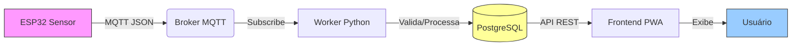

# Segurança e Gestão de Dados - SmartCat IoT

Este documento detalha o ciclo de vida dos dados no sistema SmartCat, a justificativa arquitetural da infraestrutura de nuvem utilizada (VM + Docker) e as medidas de segurança implementadas para proteger informações sensíveis, variáveis de ambiente e acessos remotos.

---

## 1. Fluxo de Dados (Data Pipeline)

O sistema adota uma arquitetura orientada a eventos, onde os dados fluem unidirecionalmente do *edge* (dispositivo) para a nuvem, garantindo integridade e rastreabilidade.

### 1.1. Etapas do Pipeline



1.  **Captura (Edge):** O ESP32 lê a tag RFID e, opcionalmente, dados de peso/tempo. Os dados são serializados em JSON e publicados via MQTT.
    *   *Tratamento de Falha:* Se o Wi-Fi cair, o ESP32 mantém os dados em um buffer circular na RAM (ou SPIFFS) e reenvia quando a conexão retornar.
2.  **Transporte (MQTT):** O broker (Mosquitto) recebe a mensagem no tópico `smartcat/+/telemetria`. O protocolo garante entrega leve (overhead mínimo de cabeçalho).
3.  **Processamento (Worker):** O serviço `worker.py` consome assincronamente as mensagens.
    *   **Deduplicação:** Verifica se a mesma tag foi lida recentemente para evitar ruído.
    *   **Regras de Negócio:** Calcula consumo de ração, tempo na caixa de areia e gera alertas.
4.  **Persistência (Database):** Dados processados são salvos no PostgreSQL. Apenas dados estruturados e validados são persistidos.
5.  **Consumo (API/Frontend):** O frontend busca dados via API REST (`GET /api/events`) e renderiza gráficos em tempo real.

---

## 2. Justificativa da Plataforma: VM + Docker

Para a defesa acadêmica e escalabilidade futura, optou-se por uma **Máquina Virtual (IaaS)** rodando **Docker**, em vez de soluções Serverless (FaaS) ou PaaS gerenciado.

### 2.1. Comparativo de Arquiteturas

| Critério | VM + Docker (Escolhido) | Serverless (AWS Lambda/Cloud Functions) | PaaS Gerenciado (Heroku/Render) |
| :--- | :--- | :--- | :--- |
| **Custo** | **Baixo e Previsível**. VM fixa (~$5-10/mês) roda 24/7 sem custo por requisição. | Variável. Pode sair caro com alto volume de telemetria constante. | Médio/Alto. Planos gratuitos têm limitações de tempo de atividade (sleep). |
| **Protocolo MQTT** | **Nativo**. Broker Mosquitto roda como container persistente, mantendo conexões TCP abertas. | **Complexo**. Requer gateways caros (AWS IoT Core) pois funções serverless não mantêm estado. | Limitado. Muitos PaaS não suportam portas long-lived para MQTT customizado. |
| **Controle/Debug** | **Total**. Acesso root via SSH, logs em tempo real, inspeção de containers. | Baixo. "Caixa preta", debug dependente de logs distribuídos. | Médio. Logs centralizados, mas acesso ao SO restrito. |
| **Portabilidade** | **Alta**. O `docker-compose.yml` roda em qualquer lugar (Local, GCP, AWS, Azure, On-premise). | Baixo. *Vendor lock-in* forte com APIs do provedor. | Médio. Dependência de buildpacks e configurações da plataforma. |
| **Complexidade** | Média. Requer gestão básica de SO (updates de segurança). | Alta. Arquitetura orientada a eventos complexa de orquestrar. | Baixa. Abstrai infraestrutura, mas limita customização. |

### 2.2. Por que não AWS IoT Core / Azure IoT Hub?
Embora sejam padrões industriais, esses serviços introduzem:
*   **Custo Elevado:** Cobrança por milhão de mensagens + gateway + regras SQL.
*   **Curva de Aprendizado:** Configuração de certificados X.509, políticas IAM e regras complexas.
*   **Overkill:** Para um projeto acadêmico com ~1 dispositivo e baixo throughput, uma VM simples é mais didática e econômica.

### 2.3. Vantagem Acadêmica
A escolha da VM + Docker permite demonstrar domínio sobre:
*   Redes (configuração de firewall, portas, DNS).
*   Sistemas Operacionais (gestão de processos, usuários, SSH).
*   Containerização (isolamento, orquestração básica).
*   Banco de Dados (administração direta do PostgreSQL).

---

## 3. Segurança de Dados e Infraestrutura

A segurança foi abordada em camadas (*Defense in Depth*), protegendo dados em trânsito, em repouso e o acesso à infraestrutura.

### 3.1. Dados em Trânsito (Criptografia)

#### Frontend (HTTPS/TLS)
*   **Implementação:** Utilizamos o **Caddy Server** como reverse proxy.
*   **Benefício:** O Caddy solicita e renova automaticamente certificados **Let's Encrypt** para o domínio `mysmartcat.carlos-santos.art`.
*   **Resultado:** Todo tráfego entre o navegador do usuário e a nuvem é criptografado via TLS 1.3.

#### Dispositivo (MQTT)
*   **Situação Atual:** O MQTT roda na porta 1883 (sem criptografia TLS) para simplificar o firmware do ESP32 (evitar overhead de processamento para SSL handshake em hardware limitado).
*   **Mitigação de Risco:**
    1.  **Firewall Restritivo:** A porta 1883 na VM está aberta apenas para o IP público necessário, e idealmente deveria ser restrita a faixas de IP conhecidas ou usar VPN.
    2.  **Payload Ofuscado:** Embora o transporte seja claro, os dados são JSON estruturados sem informações pessoais diretas (apenas IDs de tags).
*   **Melhoria Futura:** Implementar MQTT over TLS (porta 8883) gerando certificados client-side para o ESP32.

### 3.2. Secrets e Variáveis de Ambiente

Nenhuma credencial (senhas, chaves API, tokens) está *hardcoded* no código fonte.

#### Backend (.env)
As variáveis sensíveis são injetadas no container via arquivo `.env` (que está no `.gitignore`).
*   `DATABASE_URL`: Contém usuário e senha do banco.
*   `VAPID_PRIVATE_KEY`: Chave crítica para envio de notificações push.
*   `POSTGRES_PASSWORD`: Senha de administrador do banco.

**Boa Prática:** O arquivo `.env.example` está versionado apenas com chaves vazias ou placeholders, servindo de modelo sem expor segredos.

#### Firmware (Build Flags)
Credenciais de Wi-Fi e IP do Broker são injetadas no momento da compilação via `platformio.ini`:
```ini
build_flags = 
    -D WIFI_PASSWORD=\"SenhaSecreta\"
    -D MQTT_BROKER=\"34.95.195.6\"
```
*   **Vantagem:** O binário compilado contém os dados, mas o código fonte (`.cpp`) permanece limpo e seguro para versionamento público.
*   **Atenção:** O arquivo `platformio.local.ini` (com senhas reais) deve nunca ser commitado.

### 3.3. Acesso Remoto (SSH)

O acesso à VM Google Cloud segue as melhores práticas de "Hardening":

1.  **Chaves Assimétricas (Ed25519):**
    *   Acesso permitido **apenas** via chaves públicas/privadas.
    *   Autenticação por senha desabilitada no `sshd_config` (`PasswordAuthentication no`).
    *   Algoritmo Ed25519 escolhido por ser mais seguro e performático que RSA.

2.  **Usuário Não-Root:**
    *   Login direto como `root` é bloqueado (`PermitRootLogin no`).
    *   Um usuário padrão (`talktocarlossantos`) é usado, com privilégios elevados via `sudo` (com logging de comandos).

3.  **Firewall da GCP (VPC):**
    *   Porta 22 (SSH) restrita apenas aos IPs de confiança (ex: IP da sua casa/universidade), evitando varreduras globais de bots.

### 3.4. Isolamento de Rede (Docker)

A arquitetura Docker cria redes virtuais isoladas:
*   **Rede Interna (`smartcat_default`):** Apenas os containers `web`, `worker`, `db` e `broker` se enxergam.
*   **Proteção do Banco de Dados:** O PostgreSQL **não** expõe a porta 5432 para a internet. Ele só aceita conexões vindas do container `web` ou `worker`. Um atacante externo não consegue tentar força bruta contra o banco diretamente.

---

## 4. Integridade e Disponibilidade

### 4.1. Deduplicação de Mensagens
O Worker implementa uma janela de tempo (2 horas) para ignorar leituras repetidas da mesma tag na mesma estação. Isso evita:
*   Poluição do banco de dados.
*   Alertas falsos (spam de notificação).
*   Gasto desnecessário de processamento.

### 4.2. Estratégia de Banco de Dados
*   **Desenvolvimento:** SQLite (arquivo único). Fácil backup (copiar o arquivo), zero configuração.
*   **Produção:** PostgreSQL. ACID compliance, concorrência robusta, integridade referencial (Foreign Keys) para garantir que um evento sempre pertença a uma estação e um pet válidos.

### 4.3. Backup e Recuperação
Para garantir a disponibilidade dos dados históricos (importante para análise de saúde do pet a longo prazo):
*   **Sugestão de Implementação:** Script cron na VM para executar `pg_dump` diário e salvar o arquivo `.sql` em um bucket cloud (Google Cloud Storage) ou enviar por email.
*   **Volumes Docker:** O volume do banco de dados (`postgres_data`) é montado em um diretório persistente da VM, sobrevivendo a reinícios de containers.

---

## 5. Conclusão

A arquitetura apresentada equilibra **segurança**, **custo** e **didática**. Ao utilizar uma VM com Docker, garantimos controle total sobre o fluxo de dados e facilitamos a replicação do ambiente em qualquer provedor de nuvem. As medidas de segurança adotadas (HTTPS automático, isolamento de rede, gestão de secrets via env vars e acesso SSH restrito) protegem o sistema contra vulnerabilidades comuns, tornando-o adequado não apenas para fins acadêmicos, mas como base sólida para um produto MVP (Minimum Viable Product).
